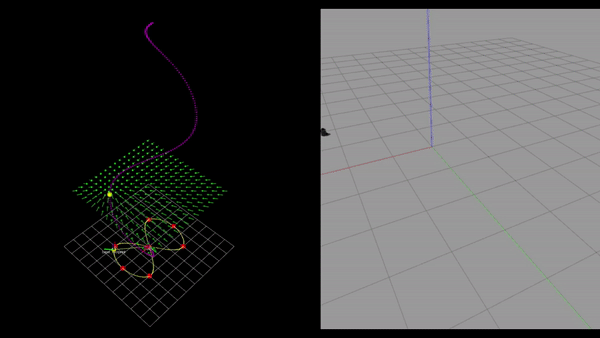

# GVF Parametric ROS

This package is a **singularity-free guiding vector field for robot navigation**. It varies from other vector-field guided path-following (VF-PF) algorithms in the next ways:

* It is  a novel method to transform self-intersected or simple closed desired paths to non-self-intersected and unbounded counterparts in a higher dimensional space.

* This approach is a combining extension of both conventional VF-PF and trajectory tracking algorithms.

* Global convergence to the desired paths, which could be even self-intersected, is rigorously guaranteed.

* Spline-curve waypoints interpolation to follow any defined path.

* Tight ROS integration.



Installation Instructions - Ubuntu 18.04 with ROS Melodic
---------------------------------------------------------
To use this package, please install first . In addition, you will also need the  package. Then, you can continue the gvf-parametric package installation as follows:

1. If you don't have a ROS workspace yet you can do so by:
```
$ mkdir -p ~/catkin_ws/src
$ cd ~/catkin_ws
$ catkin init
$ catkin config --extend /opt/ros/melodic
$ catkin config --cmake-args -DCMAKE_BUILD_TYPE=Release
$ catkin config --merge-devel
```

2. Get the turtlebot simulator and additional dependencies:
```
$ cd ~/catkin_ws/src
$ git clone git@github.com:ROBOTIS-GIT/turtlebot3_simulations.git
$ git clone git@github.com:catkin/catkin_simple.git
```

3. Now clone the gvf-parametric package:
```
$ git clone git@github.com:Novotendo/gvf-parametric-ros.git
```

4. Build your workspace and source:
```
$ cd ~/catkin_ws/
$ catkin build
$ source devel/setup.bash
```

Basic Usage
-----------
Launch the simulation with a turtlebot model, in our case the Burger, in an empty world:
```
$ roslaunch gvf_parametric sim_gvf_parametric_2d_spline.launch
```
The launch file includes a node that automatically publish an example self-intersected trajectory. This is only for testing, you can comment this node in the launch file and build your own pipeline! :D
# Paper

If you use this software in a scientific publication, please cite the following paper:

W. Yao, H. G. de Marina, B. Lin and M. Cao, **"Singularity-Free Guiding Vector Field for Robot Navigation"** in IEEE Transactions on Robotics, vol. 37, no. 4, pp. 1206-1221, Aug. 2021, doi: 10.1109/TRO.2020.3043690.

```latex
@ARTICLE{Yao2021gvfparametric,
  author={Yao, Weijia and de Marina, Héctor Garcia and Lin, Bohuan and Cao, Ming},
  journal={IEEE Transactions on Robotics}, 
  title={Singularity-Free Guiding Vector Field for Robot Navigation}, 
  year={2021},
  volume={37},
  number={4},
  pages={1206-1221},
  doi={10.1109/TRO.2020.3043690}}
```

# Credits
The spline curve interpolation library used was mainly adapted from the contribution of Tino Kluge (https://kluge.in-chemnitz.de/opensource/spline/).
